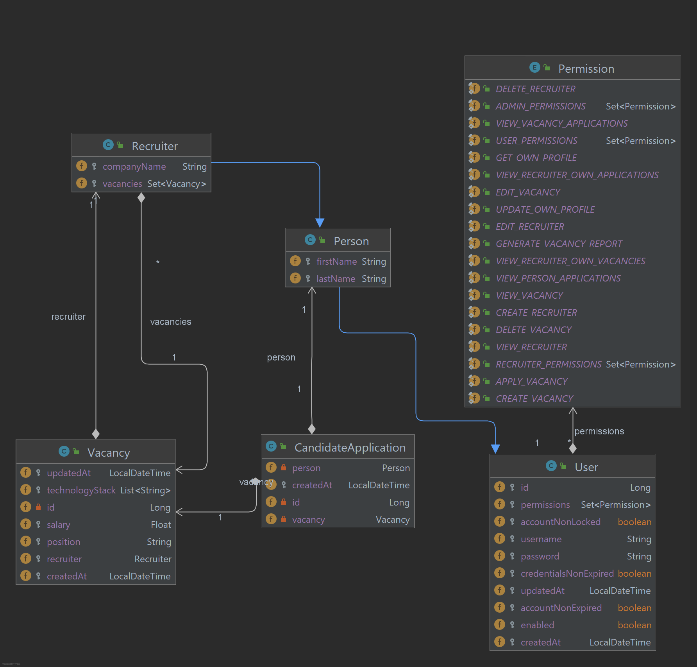

# Spring Boot and REST API

## Description

This Spring Boot application serves as a backend service for storing and managing data related to recruiters and job
vacancies. Leveraging a PostgreSQL database, it offers REST API endpoints for efficient interaction with the entities.

## Technologies

- Java 17
- Spring Boot 3.2.5 (with Spring Web, Spring Data JPA, Spring Validation)
- PostgreSQL 16
- Maven 4.0.0
- Docker
- Liquibase
- Apache POI

## Usage

The application provides the following REST API endpoints:

| Method | Endpoint                                   | Description                                    | Example field in request body                                                                                     | Roles (Permissions)            |
|--------|--------------------------------------------|------------------------------------------------|-------------------------------------------------------------------------------------------------------------------|--------------------------------|
| POST   | `/api/v1/auth/login`                       | Get JWT token for user                         | `username: admin`,  `password: admin`                                                                         | Guest (access allowed for all) |
| POST   | `api/v1/auth/register`                     | Register a new user                            | `username: admin`,  `password: admin`                                                                         | Guest (access allowed for all) |
| GET    | `/api/v1/recruiter/{id}`                   | Return details of a recruiter by ID            |                                                                                                                   | Admin                          |
| POST   | `/api/v1/recruiter`                        | Create a new recruiter                         | `first_name: Vladyslav`,  `last_name: Bondar`,  `company: ProfItSoft`                                     | Admin                          |
| PUT    | `/api/v1/recruiter/{id}`                   | Update a recruiter by ID                       | `company: ProfItSoft`                                                                                             | Admin                          |
| DELETE | `/api/v1/recruiter/{id}`                   | Delete a recruiter by ID                       |                                                                                                                   | Admin                          |
| GET    | `/api/v1/recruiter/{id}/applications`      | Applications for a recruiter by ID             |                                                                                                                   | Admin                          |
| GET    | `/api/v1/vacancy/{id}`                     | Return details of a vacancy by ID              |                                                                                                                   | User, Recruiter, Admin         |
| POST   | `/api/v1/vacancy`                          | Create a new vacancy                           | `position: Java Developer`,  `salary: 3000`,  `technology_stack: [Java, Spring]`,   `recruiter_id: 1` | Recruiter, Admin               |
| PUT    | `/api/v1/vacancy/{id}`                     | Update a vacancy by ID                         | `salary: 3500`                                                                                                    | Recruiter, Admin               |
| DELETE | `/api/v1/vacancy/{id}`                     | Delete a vacancy by ID                         |                                                                                                                   | Recruiter, Admin               |
| POST   | `/api/v1/vacancy/_list`                    | Return a list of vacancies by a filter         | `technology_stack: [Java, Spring]`                                                                                | Guest (access allowed for all) |
| POST   | `/api/v1/vacancy/_report`                  | Generate Excel report of vacancies by a filter | `technology_stack: [Java, Spring]`,   `position: Java Developer`,   `salary: 3000`                        | Admin                          |
| POST   | `/api/v1/vacancy/{id}/apply`               | Apply for a vacancy by ID (must be auth)       |                                                                                                                   | User, Admin                    |
| GET    | `/api/v1/vacancy/{id}/applications`        | Get all applications for a vacancy by ID       |                                                                                                                   | Admin                          |
| GET    | `/api/v1/vacancy/person/{id}/applications` | Get all applications for a person by ID        |                                                                                                                   | Admin                          |
| GET    | `api/v1/profile`                           | Get profile of the authenticated user          |                                                                                                                   | User, Recruiter, Admin         |
| PUT    | `api/v1/profile/update`                    | Update profile of the authenticated user       | `first_name: Vladyslav`,  `last_name: Bondar`                                                                 | User, Recruiter, Admin         |

## Testing

### Unit tests

All unit tests require Docker Engine.

### Enhanced testing endpoints

You can easly test the application using http requests. A few files for testing the application are available in
the `src/test/resources/http-requests` directory. You can use files from this directory in your IDE.